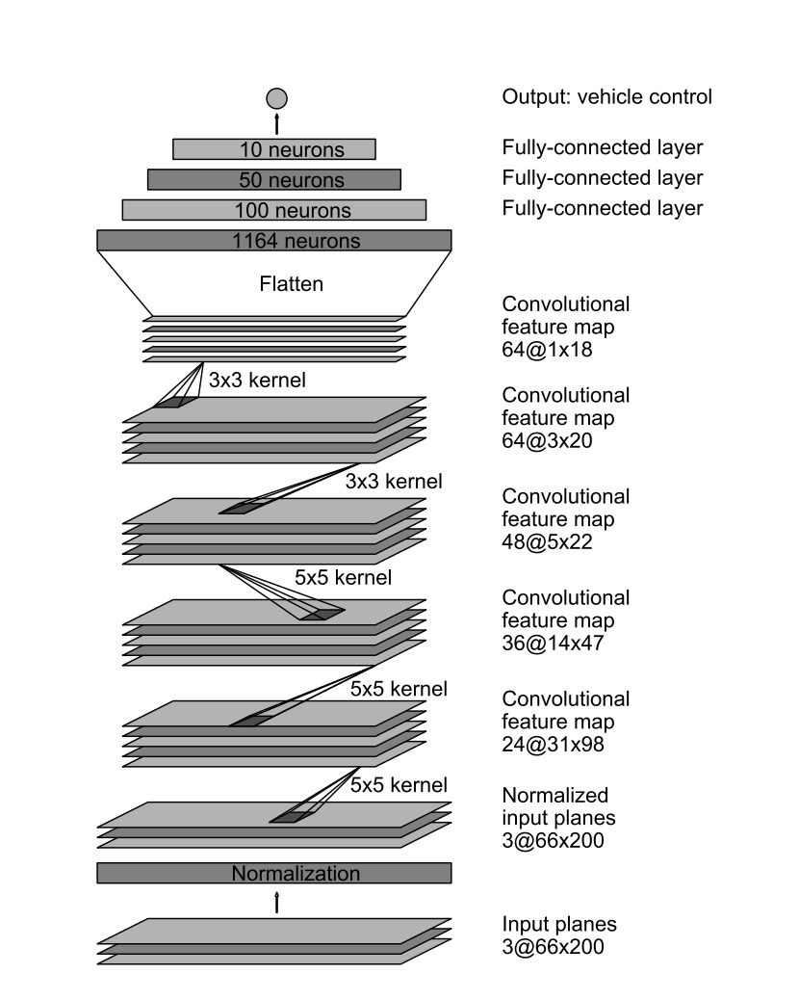
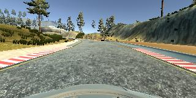
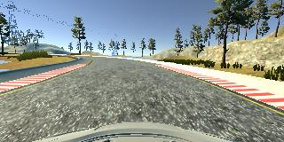
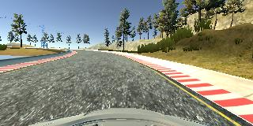
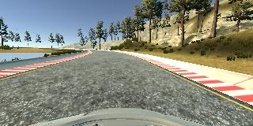
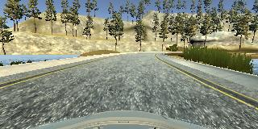
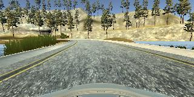
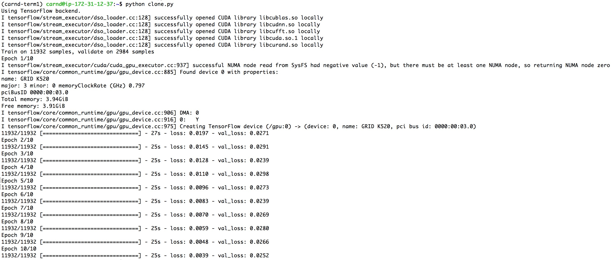

# **Behavioral Cloning**

**Behavioral Cloning Project**

The goals / steps of this project are the following:
* Use the simulator to collect data of good driving behavior
* Build, a convolution neural network in Keras that predicts steering angles from images
* Train and validate the model with a training and validation set
* Test that the model successfully drives around track one without leaving the road
* Summarize the results with a written report

**Here's the [video](https://youtu.be/iYoXtFkspM4) recording of the vehicle driving autonomously around the track in the simulator**

---
### Files Submitted & Code Quality

#### 1. Submission includes all required files and can be used to run the simulator in autonomous mode

My project includes the following files:
* model.py containing the script to create and train the model
* drive.py for driving the car in autonomous mode
* model.h5 containing a trained convolution neural network
* writeup_report.md or writeup_report.pdf summarizing the results

#### 2. Submission includes functional code
Using the Udacity provided simulator and my drive.py file, the car can be driven autonomously around the track by executing
```sh
python drive.py model.h5
```

#### 3. Submission code is usable and readable

The model.py file contains the code for training and saving the convolution neural network. The file shows the pipeline I used for training and validating the model, and it contains comments to explain how the code works.

### Model Architecture and Training Strategy

#### 1. An appropriate model architecture has been employed

My model is borrowed from the [Nvidia paper](https://arxiv.org/pdf/1604.07316.pdf) (model.py lines 53-65). It consists of a convolution neural network with three 5x5 filter sizes and depths of 24, 36, 48 each with downsample 2. Two CNN layers with 3x3 filter sizes and depths of 64 are followed. Finally, the input is flatten and mapped to three fully connected layers with 100, 50 and 10 neurons.

The model includes the cropping of the images (code line 55), five RELU layers to introduce nonlinearity (code line 56-60), and the data is normalized in the model using a Keras lambda layer (code line 54).

#### 2. Attempts to reduce overfitting in the model

The model doesn’t contains dropout layers. However, the model was trained and validated on different data sets to ensure that the model was not overfitting (code line 69). The model was tested by running it through the simulator and ensuring that the vehicle could stay on the track.

#### 3. Model parameter tuning

The model used an adam optimizer, so the learning rate was not tuned manually (model.py line 68).

#### 4. Appropriate training data

Training data was chosen to keep the vehicle driving on the road. I used a combination of center driving, a few recovery laps and driving counter-clockwise. Nice driving around the curves are always maintained during the training. For details about how I created the training data, see the next section.

### Model Architecture and Training Strategy

#### 1. Solution Design Approach

The overall strategy for deriving a model architecture was to build a somewhat complex network utilizing the AWS graphic resources. My first step was to use a convolution neural network model similar to the LeNet architecture. I thought this model might be appropriate because LeNet is the pioneering invention of CNN.

In order to gauge how well the model was working, I split my image and steering angle data into a training and validation set. I found that my first model had a high mean squared error on the training set and a high mean squared error on the validation set. Therefore, the vehicle couldn’t stay on the track.

To improve the model, I borrowed the model from the Nvidia paper, which is more complex and required to use GPU to train. Then I got an MSE of 0.0197 in the first epoch and 0.0039 in the tenth epoch. The MSE of validation also improved a lot with 0.0271 in the first and 0.0252 in the last epoch.

The final step was to run the simulator to see how well the car was driving around track one. Vehicle didn’t fall off the track at all, probably because of the recovery laps that I have recorded. At the end of the process, the vehicle is able to drive autonomously around the track without leaving the road.

#### 2. Final Model Architecture

The final model architecture (model.py lines 53-65) consisted of a convolution neural network with the following layers and layer sizes in a visualization of the architecture



#### 3. Creation of the Training Set & Training Process

To capture good driving behavior, I first recorded two laps on track both using center lane driving. Here is an example image of center lane driving:



I then recorded the vehicle recovering from the left side and right sides of the road back to center so that the vehicle would learn to steer away. These images show what a recovery looks like starting from these screenshots:





On track two, I only did center driving in order to get more data points.

To augment the data sat, I also flipped images and angles thinking that this would increase the magnitude of dataset according to the Nvidia paper. For example, here is an image that has then been flipped:




After the collection process, I had 14916 number of data points. The data was then preprocessed with normalization and randomly shuffled. 2% of the data into a validation set.

I used the training data for training the model. The validation set helped determine if the model was over or under fitting. The ideal number of epochs was 10. An adam optimizer was used so that manually training the learning rate wasn't necessary.

Here is the result:


